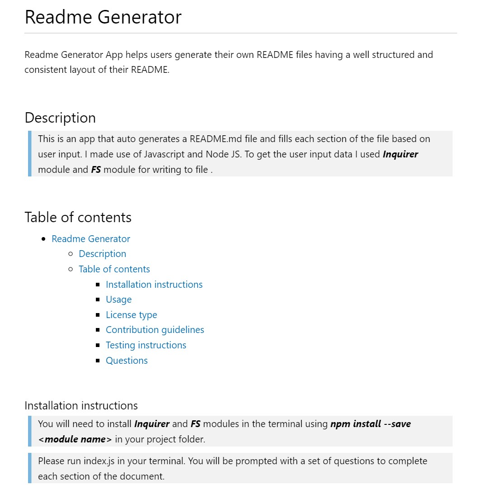

# Readme Generator

Readme Generator App helps users generate their own README files having a well structured and consistent layout of their README.

&nbsp;

## Description

This is command-line application that accepts user input and creates a readme file based on that. Javascript and Node JS was used to create this app together with ***Inquirer***, to collect user input and ***FS*** module for writing to file.

&nbsp;

## Table of contents

- [Readme Generator](#readme-generator)
  - [Description](#description)
  - [Table of contents](#table-of-contents)
    - [**Installation instructions**](#installation-instructions)
    - [**Usage**](#usage)
    - [**License type**](#license-type)
    - [**Contribution guidelines**](#contribution-guidelines)
    - [**Testing instructions**](#testing-instructions)
    - [**Questions**](#questions)

&nbsp;

### **Installation instructions**

Software requirements:

- Text editor. [VS Code]("https://code.visualstudio.com/") is recommended
- [Git]("https://git-scm.com/downloads")
- [Node JS]("https://nodejs.org/en/download/")
- In your project folder, install in the terminal  ***Inquirer*** and ***FS*** modules using ***npm install --save \<module name>***

&nbsp;

### **Usage**

You can use the app to automaticaly generate your project README. A screenshot of the final result can be found bellow.

&nbsp;

&nbsp;

### **License type**

  The application is covered under **MIT** license. More about it can be found here [MIT license info](https://opensource.org/license/mit/).

&nbsp;

### **Contribution guidelines**

Contributions are welcomed. Please verify you are submitting well-formed pull requests and open useful issues.

&nbsp;

### **Testing instructions**

Testing can be ran locally after a pull request has been made successfully and required modules have been installed.

&nbsp;

### **Questions**

For any questions or feedback please ping me a message on **[Github](https://github.com/georgeboholteanu)** or send an email at <mailto:george.boholteanu@gmail.com>.

&nbsp;

© 2023 George Boholteanu. All Rights Reserved.