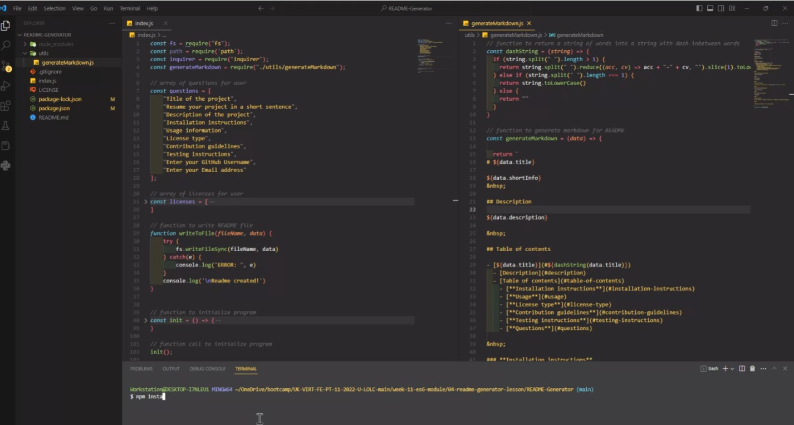

# Readme Generator


Readme Generator App helps users generate their own README files having a well structured and consistent layout of their README. This allows the project creator to devote more time to working on the project.

&nbsp;

## Description

This is command-line application that accepts user input and creates a readme file based on the data provided. Javascript and Node JS was used to create this app together with ***Inquirer***, to collect user input and ***FS*** module for writing to file.

&nbsp;

## Table of contents

- [Readme Generator](#readme-generator)
  - [Description](#description)
  - [Table of contents](#table-of-contents)
    - [**Installation instructions**](#installation-instructions)
    - [**Usage**](#usage)
    - [**License type**](#license-type)
    - [**Contribution guidelines**](#contribution-guidelines)
    - [**Testing instructions**](#testing-instructions)
    - [**Questions**](#questions)

&nbsp;

### **Installation instructions**

Software requirements:

- Text editor. [VS Code](https://code.visualstudio.com/) is recommended
- [Git](https://git-scm.com/downloads)
- [Node JS](https://nodejs.org/en/download/)
- In your project folder, using ***npm install --save \<module name>***  install in the terminal  
  - ***[Inquirer package](https://www.npmjs.com/package/inquirer)***

  - ***[FS package](https://www.npmjs.com/package/fs)***

&nbsp;

### **Usage**

The application will be invoked by using the following command:

```bash
node index.js
```

User will be presented a set of questions and the answers will fill each section of the README document. A new file called README_out.md file will be saved in the project folder after user answers all questions, in order not to overwrite existing readme. User can rename the file later to README.md

A demo video with use instructions can be found by clicking the image bellow.

&nbsp;

[](https://drive.google.com/file/d/16oEwrMbkcP0g4I2lZVqd4LoPwBd9Dl_V/view "Demo-Instructions")

&nbsp;

### **License type**

  The application is covered under **MIT** license. More about it can be found here [MIT license info](https://opensource.org/license/mit/).

&nbsp;

### **Contribution guidelines**

Contributions are welcomed. Please verify you are submitting well-formed pull requests and open useful issues.

&nbsp;

### **Testing instructions**

Testing can be ran locally after a pull request has been made successfully and required modules have been installed.

&nbsp;

### **Questions**

For any questions or feedback please ping me a message on **[Github](https://github.com/georgeboholteanu)** or send an email at <george.boholteanu@gmail.com>

&nbsp;

---
© 2023 George Boholteanu. All Rights Reserved.
